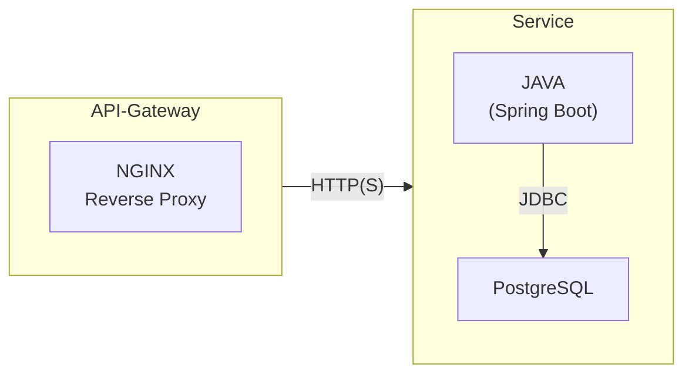
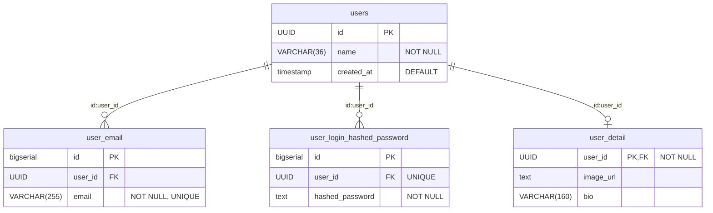

# JAVA-USER-SSERVICE with JWT
## Technology Stack
> **DOCKER**: <br> コンテナ化技術を使用して、各サービスの依存関係を管理し、環境の一貫性を保ちます。
>
> **NGINX**: <br> リバースプロキシサーバーとして、外部からのリクエストを各マイクロサービスにルーティングを担当します。
>
> **JAVA**: <br> ユーザー登録・認証ビジネスロジックを実装するためのプログラミング言語として使用します。spring bootフレームワークを利用してマイクロサービスを構築します。
>
> **PSQL (PostgreSQL)**: <br> ユーザー情報の永続化を担当するリレーショナルデータベース管理システムです。データの整合性を提供します。

<br>

## HOW TO USE
1. プロジェクトの初期化
```sh
./init.sh
```
2. Dockerコンテナの起動
```sh
cd boiler && BUILDKIT_INLINE_CACHE=1 docker compose up -d --build
```
3. workspaceコンテナへ接続
```sh
docker compose exec workspace bash
```
4. JAVA server start/stop
```sh
./server.sh -up | -down
```
5. Hhealth check
```sh
curl http://127.0.0.1:3939/user-service/health
```
6. 自由にサービスの追加、Dokerfileでコンテナ追加など

<br>

## Architecture 


<br>

## TABLE RELATION


<br>

## API-endpoint
> **user-api**: ユーザーの登録、認証、認可、プロフィール管理などを担当
> - port: 9000
> - endpoints　[/api/v1/]
>   - POST /user/register: ユーザー登録
>     - req: { "email": "user@example.com", "password": "password", "name": "User Name" }
>     - res: ユーザー登録成功時のメッセージ,ユーザーIDの返却
>   - GET /user/{id}: ユーザー情報の取得
>   - POST /user/edit: ユーザー情報の編集   // 未実装
>   - POST /user/delete: ユーザー情報の削除
>   - POST  /auth/login: ログイン
>   - POST /user/auth/logout: ログアウト,ユーザーのセッションを無効にする   //未実装
>     - req: { "token": "current_token" }
>     - res: ログアウト成功のメッセージ.
>   - POST /user/auth/refresh: トークンのリフレッシュ   //未実装
>   - POST /user/auth/forgot-password: パスワードを忘れた場合のリセットリクエスト   //未実装
